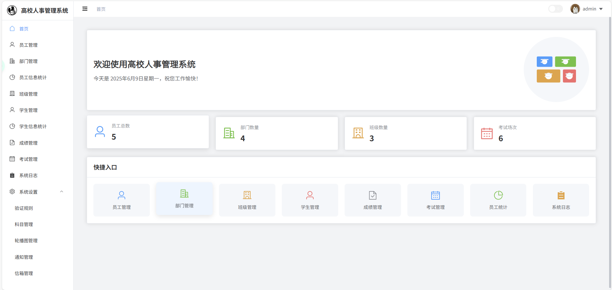

# IKUN Manager
<div align=center></div>

<div align=center>
  <a href="./README.md">中文</a> / <a href="./README.en.md">English</a>
</div>

## 项目简介
一个基于 Vue3 + Element Plus + TypeScript 开发的 **可运行于 Web 或打包为桌面应用** 的学员/员工信息管理系统。它不仅包含完整的**用户、部门、员工、班级、学生、考试、成绩**等核心模块的增删改查功能，还实现了一系列高阶特性，例如：**多维度的成绩统计与排名分析、支持富文本的通知系统、学生与管理员之间的信箱交流系统、灵活的系统配置（如正则校验、日志保留策略）以及可打包为跨平台桌面应用的能力**，旨在提供一个功能全面、体验优秀的一体化管理解决方案。

## 技术栈
- **前端**: Vue 3, TypeScript, Vite, Element Plus, Pinia, Vue Router, Axios, ECharts, Socket.IO Client, Sass, Day.js, WangEditor
- **后端**: Java 17, Spring Boot 3, MyBatis, MySQL, Spring Security, JSON Web Token (JWT), Lombok, PageHelper, Swagger
- **桌面端**: Electron, electron-builder

## 功能特性
- 👤 **用户管理**: 登录、用户信息获取、**头像上传与个人资料更新**
- 🏢 **部门管理**: 增删改查、**数据导入/导出 (Excel/CSV)**
- 👨‍💼 **员工管理**: 增删改查、关联部门、**数据导入/导出 (Excel/CSV)**
- 🎓 **班级管理**: 增删改查、关联教师、**数据导入/导出 (Excel/CSV)**
- 🧑‍🎓 **学生管理**: 增删改查、关联班级、**数据导入/导出 (Excel/CSV)**
- 📝 **考试管理**: 增删改查、发布/取消发布、**关联班级与科目**
- 📊 **成绩管理**: 
    - 学生各科成绩的录入、查询、统计与导出
    - **生成详细成绩报告**：包含单科与总分的**班级/年级排名**、平均分、最高分等多维度分析
- 📢 **通知系统**:
    - 管理员通过**富文本编辑器**创建、发布、管理通知公告
    - 学生门户首页时间线实时展示
- 📬 **信箱系统**:
    - 学生可创建问题线索并发送消息
    - 管理员可回复并**更新处理状态**（如：已回复、已解决）
- 🖼️ **轮播图管理**:
    - 后台可上传、管理门户首页的轮播图图片
    - 可配置轮播间隔时间
- 🚪 **学生门户**:
    - 独立于后台管理的**学生专属界面**
    - 查看个人成绩、详细报告、待考考试、通知公告、收发信件
- 📈 **数据可视化**: 提供仪表盘展示核心统计数据
- 📑 **日志管理**: 系统操作日志的记录与查询、**删除确认**、**基于 WebSocket 的实时日志推送**、**可配置保留天数与自动清理**
- ⚙️ **系统设置**: 配置学号/工号验证 **正则表达式**、配置日志保留天数
- ✨ **前端体验**:
    - 基于 Element Plus 的美观 UI，支持**深色模式**切换
    - 可搜索、筛选、分页的数据表格
    - 完善的表单校验
    - Axios 封装与请求/响应拦截
    - Pinia 状态管理 (用户状态持久化)
- 🔧 **开发支持**:
    - 全面使用 **TypeScript**，提供类型安全
    - **ESLint** 代码规范检查
    - 支持 **Mock 数据**，方便前后端分离开发 (`src/utils/request.ts`)
    - 清晰的模块化项目结构
- 🖥️ **桌面端支持 (Electron)**:
    - 可打包为 Windows, macOS, Linux 桌面应用
    - **沉浸式自定义标题栏** (Windows/Linux)
    - 支持**开发环境热更新**

## 项目截图

| 后台管理系统仪表盘 | 账户登录页 |
| :---: | :---: |
|  |  |
| **学生门户 - 通知公告** |
|  |

## 开发环境准备

### 推荐的IDE配置

- [VSCode](https://code.visualstudio.com/)
- [Volar](https://marketplace.visualstudio.com/items?itemName=Vue.volar) (需要禁用 Vetur)
- [TypeScript Vue Plugin (Volar)](https://marketplace.visualstudio.com/items?itemName=Vue.vscode-typescript-vue-plugin)

### 环境要求
- Node.js 16+ (用于前端 Vite / Electron)
- MySQL 8.0+
- npm 7+ (或 pnpm/yarn)
- JDK 17+
- Maven 3.8+

## 项目设置

### 安装依赖
```sh
npm install
# 构建后端 (Spring Boot)
cd java-backend
mvn clean install -DskipTests
cd ..
# 安装 Electron 相关依赖 (如果尚未安装)
npm install --save-dev electron electron-builder concurrently cross-env
```

### 配置数据库
1.  创建数据库
    ```sql
    CREATE DATABASE ikun_db CHARACTER SET utf8mb4 COLLATE utf8mb4_unicode_ci;
    ```

2.  导入数据库文件 `ikun_db.sql`
    ```sh
    # 需要先安装 MySQL 客户端
    mysql -u root -p ikun_db < ikun_db.sql
    ```

3.  配置后端数据库连接
    修改 `src/server/config.js` 中的数据库连接信息:
    ```js
    db: {
      host: 'localhost',
      user: 'your_mysql_user', // 替换为你的 MySQL 用户名
      password: 'your_mysql_password', // 替换为你的 MySQL 密码
      database: 'ikun_db',
      port: 3306 // 默认端口
    }
    ```

### 开发环境运行

**方式一：Web 浏览器运行 (前后端分离)**
```sh
# 1. 启动后端服务 (默认 http://localhost:8081)
cd java-backend
mvn spring-boot:run

# 2. 在项目根目录启动前端服务 (默认 http://localhost:5173)
cd ../..
npm run dev
```
然后在浏览器中打开 `http://localhost:5173`。

**方式二：Electron 桌面应用运行 (带热更新)**
```sh
# 1. 确保后端服务已启动 (见方式一的步骤 1)

# 2. 在项目根目录运行 Electron 开发脚本
npm run electron:dev
```
这将同时启动 Vite 开发服务器和 Electron 窗口，窗口会加载 Vite 服务并支持热更新。

### 生产环境构建

**构建 Web 版本:**
```sh
# 构建前端静态文件 (输出到 dist 目录)
npm run build
```
将 `dist` 目录部署到 Web 服务器，并确保后端服务在运行。

**构建 Electron 桌面应用:**
```sh
# 构建前端 + 打包 Electron 应用 (输出到 dist_electron 目录)
npm run electron:build
```
这会先构建 Vue 应用到 `dist`，然后使用 `electron-builder` 打包。

### 代码检查与类型检查
```sh
# 运行 ESLint 代码检查和修复
npm run lint

# 运行 TypeScript 类型检查
npm run type-check
```

## 项目结构
```
IKUN_Manager/
├── build/                   # Electron 打包资源 (例如图标)
├── dist/                    # 前端构建输出 (Web)
├── dist_electron/           # Electron 打包输出 (桌面应用)
├── electron/                # Electron 主进程和预加载脚本
│   ├── main.js
│   └── preload.js
├── public/                  # 静态资源 (会被直接复制)
├── src/                     # 前端源码 (Vue + TS)
│   ├── api/
│   ├── assets/
│   ├── components/
│   ├── layouts/
│   ├── router/
│   ├── stores/
│   ├── types/
│   ├── utils/
│   └── views/
├── java-backend/              # 后端源码 (Spring Boot + MyBatis)
│   ├── src/main/java/...
│   ├── src/main/resources/
│   ├── pom.xml               # Maven 配置
│   └── target/               # 构建输出目录
├── .env.development
├── .env.production
├── .eslintrc.cjs
├── .gitignore
├── ikun_db.sql              # 数据库初始化脚本
├── index.html
├── package.json             # 项目依赖与脚本配置 (前端 + Electron)
├── README.md
├── tsconfig.json
├── tsconfig.node.json
└── vite.config.ts
```

## 开发规范
- 遵循 `.eslintrc.cjs` 中定义的 ESLint 规则
- 全面使用 TypeScript 编写代码，定义清晰的类型
- 组件、函数、关键逻辑需要添加 JSDoc 注释
- Git commit 信息遵循 [Conventional Commits](https://www.conventionalcommits.org/) 规范 (推荐)
- 保持代码简洁、可读、可维护

## 部署说明

### Web 版本
1.  **构建前端**: 运行 `npm run build` 生成静态文件到 `dist` 目录。
2.  **部署后端**: 将 `java-backend` 目录部署到服务器，安装依赖 (`mvn clean install -DskipTests`) 并使用 `mvn spring-boot:run` 启动服务。
3.  **配置 Web 服务器 (如 Nginx)**:
    *   配置静态文件服务指向前端构建的 `dist` 目录。
    *   配置反向代理将 API 请求 (例如 `/api/*`) 转发到后端 Node.js 服务运行的端口。
    *   (可选) 配置 SSL 证书启用 HTTPS。

### 桌面应用版本
1.  运行 `npm run electron:build` 生成对应平台的安装包（位于 `dist_electron` 目录）。

## 贡献指南
欢迎贡献！请遵循以下步骤：
1.  Fork 本仓库
2.  基于 `main` 分支创建新的特性分支 (例如 `feat/add-new-feature` 或 `fix/resolve-bug`)
3.  在你的分支上进行开发和提交代码
4.  确保通过代码检查 (`npm run lint`) 和类型检查 (`npm run type-check`)
5.  发起 Pull Request 到 `main` 分支，并清晰描述你的更改

## 开源许可
[MIT License](LICENSE)

## 联系方式
- 作者: [chyinan]
- Email: [chyinan2015@gmail.com]
